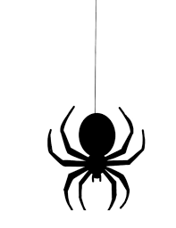

<!DOCTYPE html>
<html>
  <head>
    
    <title class="title">Chaotic-sandbox</title>
    
welcome to my sandbox of learning. This place is a
      place of learning so please paedon any of my mistakes.

  </head>
  <body style="background-color: rgb(164, 241, 241);">
    
ooh!!! a spider. something to look at i guess.

    
    <input class= nave type="text" placeholder="Search.."> 
    
Here are some non-linked buttons to press.

    <button class="subscribe-button">subscribe</button>
    <button class="join-button">Join my channel</button>
    <button class="tweet-button">tweet</button>
    
here is a finctional link to youtube

    <a href="https://www.youtube.com/"target="_blank">
      link to youtube</a></body>
      

  <ul>
    <li><a href="books.html">red</a></li>
    <li><a href="child.html">green</a></li>
    <li><a href="parent.html">blue</a></li>
    <li><a href="potion.html">potion</a></li>
  </ul>

  </body>

</html>
