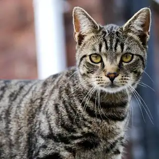

This is my chaotic playground
<!DOCTYPE html>

<button class="subscribe-button">subscribe</button>

<button class="join-button">Join my channel</button>

<button class="tweet-button">tweet</button>

Here is a picture of a cat to look at. 

  <body>
      
  </body>

  <button class="untest-button">untest</button>
  
